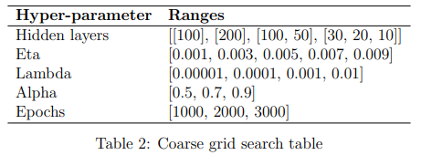

# Neural Network Simulator

```
Chenxiang Zhang Simone Rizzo
{c.zhang4, s.rizzo14}@studenti.unipi.it
ML course (654AA), Academic Year: 2020/
Date: 18/01/
Type of project: A (Python)
```

### Abstract
The following project is an implementation of a
simulator for the neural net-work architecture
using the Python language.  We developed a multi-layer
neuralnetwork, which learns through the gradient descend
algorithm.  We have developedfew utility functions
(grid search, k-fold cross validation) for searching
through thespace  to  find  the  best  hyperparameters.
At  the  end,  we  applied  the  ensemblingtechnique to
produce the results for the blind cup test.


## 1 Introduction

In the last decade, neural networks continuously raised interest among the academic and
the industrial world. The goal of this work is to explore in detail and fully understand
the functioning of a neural network. In order to do this, we built a simulator from scratch
using the Python language. The architecture is a multi-layer neural network, each layer
is a fully connected layer. The network learns from data using the gradient descend
algorithm. The aim of the project is to search and validate the best model configuration
for the proposed CUP dataset.

Section 2 describes in detail the implementation of the architecture; Section 3 reports
the experiments we did to test the correctness of the simulator using the monk dataset
[5] and results we obtained from the CUP dataset.

## 2 Method

The simulator for the neural network is developed without the usage of any already
existing libraries for machine learning. The programming language chosen is Python.
The libraries we used to speed up the implementation are:

- numpy, vectorization and numerical computations.
- matplotlib, visualization of plots.
- scikit-learn, manipulation of dataset

### 2.1 Architecture Design

The architecture must be scalable and modular for a multi-layer network. To achieve
these properties we have created two main different classes. The first one isDeepNeural-
Network and it is the core of the network, it is scalable by adding an arbitrary number
of the second classLayerforming a final multi-layer network.

- DeepNeuralNetowork. The network is made by creating and connecting n-layers.
  Given an input data, the output of the network is computed by passing the data
  through all the layers using the function feedforward(). To compute the error
  and update the weights the function backpropagate() is used for gradient descend
  algorithm. The training and validation are handled by the function fit().
- Layer. This is the piece of component that makes up the network. Each layer has a
  weight matrix storing all the connections with the previous layer and an activation
  function.


The network learns through the gradient descent algorithm using the batch version. This
means that all the data are grouped in one single big matrix and fed to the network.
For the weight initialization, we have implemented three different techniques: “default”,
“xav” [1] and “he”[3]. The first is a commonly used heuristic. The “xav” initialization
preserves the activation variance and back-propagated variance between the layers in a
deep network. This can help to escape early weight saturation bringing substantially
faster convergence. The idea for “he” initialization is the same as “xav” but applied to
the nonlinearity of ReLU function.

Additional features that have been chosen and implemented in the architecture system
are the following:

- Regularization. Tikhonov regularization to regularize the model complexity
- Classical momentum. Allows faster convergence and stabilizing effect in directions
  that oscillate in sign
- Activation functions. The following activation functions and their corresponding
  derivative have been implemented: “sigmoid”, “tanh”, “relu”, “identity”
- Ensembling. Combines multiple different models averaging their results. This tech-
  nique lowers the variance.

### 2.2 Validation Data

The data splitting for the monk problem is 80% train data and 20% valid data. We don’t
need to split for test data since it is already given in a separated file. For the cup problem
we first set aside 10% of the whole data as our internal test set. Then the remaining data
is split in 80% train data and 20% valid data.

### 2.3 Model Selection and Assessment

In order to search for the best hyper-parameters for a model, we implemented the grid
search. Every iteration of the grid, a new model with a new hyper-parameter configu-
ration is selected. The model is trained and validated using the k-fold cross validation.
This technique splits the training set into k blocks. Then it trains the model from scratch
for k-times using a different block as validation data every time. At the end, we have a
list of models sorted by validation loss.

In the last phase the model assessment is applied. The best model is composed by
the top-9 neural networks found through the grid search. Each network is trained with
both the training and validation data, and the output is the average of all the network’s
output. The test loss is calculated using the internal test data on the ensembled model.


## 3 Experiments

The approach that we followed for the experiment is to first assess the correctness of our
network by facing the monk problem. We compare our results with the one reported
on the original paper[5]. Once the results are approximately close, we pass to the cup
dataset. We first run the experiment with a coarse grid search, then with few refinement
grid search we find our champion model to bring for the cup challenge.

### 3.1 Monk Problem

The monk problems requires to apply the one-hot encoding to the input data. The model
used for all the monk problems has 4 hidden units, use the batch gradient descent, L
regularization and the classical momentum. Through different execution, we saw that
the problem is very sensitive to the weights initialization, thus we initialized the weights
in the range [-0.003, 0.003].The loss is computed with theMean Squared Error.


The plots for all the monk problems are reported in the Figure 2

### 3.2 Cup Problem

Before starting to launch the proper grid search, we performed a screening phase with
some arbitrary set of configurations to study how the network behaves with the cup
dataset. With the results of this preliminary search, we decided to use the “tanh”
activation function and the “default” weight initialization as the network with these two
hyper-parameters always had the best results.

In order to explore for the remaining hyper-parameters we chose to perform a search
that is divided into two phases. First, a coarse search is carried out which takes var-
ious types of networks with different hidden layers and large steps between the hyper-
parameters. In the second phase, a refinement search is performed based on the results
of the first phase. This time the steps are smaller and focused on the range of values that
achieved the best on the first phase. By applying these two phases we can explore a larger  


Figure 1: Plot of the MSE (left) and accuracy (right) for all the monk problems. Starting
from the top, MONK1, MONK2, MONK3, MONK3 (reg)


hyper-parameter space while also reducing the computation time. For each configuration
the model is validated with k-fold cross validation (k=4).

- Coarse search. Table 2 is created to choose the intervals for the hyper-parameters.
  Each configuration of the hyper-parameter are distant (with big step) from each
  other. This technique performs a first phase of screening for bad hyper-parameters
  intervals, allowing us to focus on the “good range” in the second phase.



- Refinement. Once the first phase is over, we choose the hyper-parameters that gave
  us the lowest validation loss. On these values we build a new Table 3 to perform
  the grid search that goes to refine the hyper-parameters more accurately as we use
  smaller intervals.

  

3.2.1 Grid search result

After the grid search is terminated, the top 9 model configurations with the lowest
validation loss is reported in the Table 4. In order to lower the variance of the final
results we decided to apply the ensembling technique combining all the top 9 models.
The results on the internal test set using the ensembling model is 3.204, reported at the
bottom of the Table 4.


  

3.2.2 Computing time

Python does not allow the execution of parallel threads due to the GIL (Global Inter-
preter lock). The interpreter makes sure that only one thread is executing the code at
a given moment. For this reason we decided to use different computers to speed up the
computation. We divided the grid search manually into several smaller parts distributing
the training on each machine. The hardware used were:

- Intel i7-7700K, 4.20 GHz
- Intel i7-10750H, 2.60 GHz
- Intel i7-10750H, 2.60 GHz
- Intel i7-9750H, 2.60 GHz


The average time taken by a computer to perform training on the MONK dataset with
800 epochs is 1.5 seconds, for ML CUP dataset with 3000 epochs and 100 units it is
around 3 minutes considering the kfold cross validation. In total, 1260 configurations
were tested which took an estimate of 36 hours of computational time.

## 4 Conclusion

Thanks to the studies conducted during the class, we were able to build a functioning
and performing simulator that includes different additional features (regularization, mo-
mentum, ensembling). To build a neural network simulator involves in a lot of trial and
error. After this project, we gained confidence in our understanding in the functioning of
this powerful architecture. We learned the importance of model selection and assessment
and the difficulty in finding the correct hyper-parameters. This project gave us a strong
foundation on which it is possible to stack more blocks of knowledge for the future.

```
The blind test results file name isCIVICO13ML-CUP20-TS.csv.
```
### 4.1 Acknowledgments

We agree to the disclosure and publication of my name, and of the results with preliminary
and final ranking.


## References

[1] Xavier Glorot and Yoshua Bengio. Understanding the difficulty of training deep
feedforward neural networks. 9:249–256, 2010.

[2] Ian Goodfellow, Yoshua Bengio, and Aaron Courville. Deep Learning. MIT Press,
2016.http://www.deeplearningbook.org.

[3] Kaiming He, Xiangyu Zhang, Shaoqing Ren, and Jian Sun. Delving deep into rec-
tifiers: Surpassing human-level performance on imagenet classification. pages 1026–
1034, 2015.

[4] Tom M. Mitchell. Machine learning, International Edition. McGraw-Hill Series in
Computer Science. McGraw-Hill, 1997.

[5] S. B. Thrun, J. Bala, E. Bloedorn, I. Bratko, B. Cestnik, J. Cheng, K. De Jong, S. Dze-


